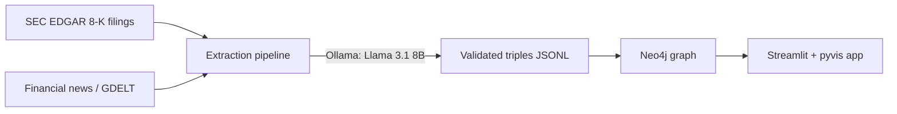

# Finance Knowledge Graph

Extracts a knowledge graph of **S&P 500 M&A activity and executive leadership changes** from SEC 8-K filings and financial news, using a local LLM (Llama 3.1 8B via Ollama) for entity/relation extraction. The graph is stored in Neo4j and explored through an interactive Streamlit app with both exact-match and **semantic search** over entities.

## Architecture



**Pipeline stages:**
1. **Ingest** (`src/ingest/`) — pull S&P 500 constituent list, fetch 8-K filings from SEC EDGAR and headlines from GDELT.
2. **Extract** (`src/extraction/`) — chunk documents, prompt a local Llama 3.1 8B model for `(subject, relation, object)` triples constrained to a fixed relation vocabulary (`ACQUIRED`, `MERGED_WITH`, `APPOINTED_AS`, `RESIGNED_FROM`, `INVESTED_IN`, ...), validate with Pydantic, retry on malformed output.
3. **Load** (`src/graph/`) — upsert entities and relationships into Neo4j via `MERGE`, with basic name normalization to reduce duplicate nodes. Every entity also gets embedded locally (Ollama `nomic-embed-text`) and indexed in Neo4j's native vector index for semantic search.
4. **Explore** (`src/app/`) — Streamlit app: exact-match search or **semantic search** (search by meaning, e.g. "pharma company") for an entity, view its interactive neighborhood graph, see basic graph stats.

## Setup

### 1. Clone and install dependencies
```bash
python -m venv .venv && source .venv/bin/activate
pip install -r requirements.txt
cp .env.example .env  # edit if needed
```

### 2. Start Neo4j
```bash
docker compose up -d
```
Browser UI at http://localhost:7474 (user: `neo4j`, password: `changeme` — change in `docker-compose.yml` and `.env` for anything beyond local use).

### 3. Start Ollama and pull the models
```bash
brew install ollama   # or see https://ollama.com
ollama serve
ollama pull llama3.1:8b        # extraction
ollama pull nomic-embed-text   # embeddings for semantic search
```

### 4. Run the pipeline
```bash
python -m src.ingest.sp500
python -m src.ingest.sec_edgar
python -m src.ingest.news
python -m src.extraction.extract
python -m src.graph.loader
```

### 5. Launch the app
```bash
streamlit run src/app/streamlit_app.py
```

### 6. Try semantic search from the CLI (optional)
```bash
python -m scripts.try_semantic_search "pharma company"
python -m scripts.try_semantic_search "bank or financial institution" --k 5
```

## Known limitations
- Entity resolution is simple string normalization (case, common suffixes) — no fuzzy matching or external ID linking (e.g. Wikidata QIDs) yet.
- Local 8B model extraction is noisier than a hosted frontier model; the pipeline validates and retries but some garbage triples can still slip through.
- Relation vocabulary is intentionally small/fixed to keep the graph clean, at the cost of missing nuance in the source text.
- Semantic search embeds entity *names* only (not full relationship facts), so results are ranked by how similar a name reads, not by broader context — quality also depends on how many distinct entities of a given kind exist in the loaded data.
- If you already have data loaded from before semantic search was added, `MERGE`'s label-matching means adding the shared `:Entity` label to the query can create duplicate nodes instead of tagging existing ones — wipe the graph (`MATCH (n) DETACH DELETE n`) and reload from `data/processed/triples.jsonl` rather than reloading on top of old data.

## License
MIT
