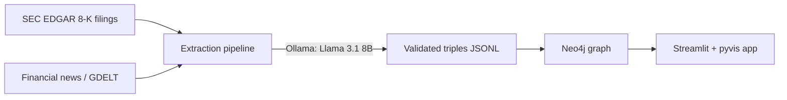

# Finance Knowledge Graph

Extracts a knowledge graph of **S&P 500 M&A activity and executive leadership changes** from SEC 8-K filings and financial news, using a local LLM (Llama 3.1 8B via Ollama) for entity/relation extraction. The graph is stored in Neo4j and explored through an interactive Streamlit app.

## Architecture



**Pipeline stages:**
1. **Ingest** (`src/ingest/`) — pull S&P 500 constituent list, fetch 8-K filings from SEC EDGAR and headlines from GDELT.
2. **Extract** (`src/extraction/`) — chunk documents, prompt a local Llama 3.1 8B model for `(subject, relation, object)` triples constrained to a fixed relation vocabulary (`ACQUIRED`, `MERGED_WITH`, `APPOINTED_AS`, `RESIGNED_FROM`, `INVESTED_IN`, ...), validate with Pydantic, retry on malformed output.
3. **Load** (`src/graph/`) — upsert entities and relationships into Neo4j via `MERGE`, with basic name normalization to reduce duplicate nodes.
4. **Explore** (`src/app/`) — Streamlit app: search an entity, view its interactive neighborhood graph, see basic graph stats.

## Roadmap
- [ ] **Semantic search** — embed entity names locally (Ollama `nomic-embed-text`), index them with Neo4j's native vector index, and let users search by meaning (e.g. "pharma company") instead of exact substring match.

## Setup

### 1. Clone and install dependencies
```bash
python -m venv .venv && source .venv/bin/activate
pip install -r requirements.txt
cp .env.example .env  # edit if needed
```

### 2. Start Neo4j
```bash
docker compose up -d
```
Browser UI at http://localhost:7474 (user: `neo4j`, password: `changeme` — change in `docker-compose.yml` and `.env` for anything beyond local use).

### 3. Start Ollama and pull the model
```bash
brew install ollama   # or see https://ollama.com
ollama serve
ollama pull llama3.1:8b
```

### 4. Run the pipeline
```bash
python -m src.ingest.sp500
python -m src.ingest.sec_edgar
python -m src.ingest.news
python -m src.extraction.extract
python -m src.graph.loader
```

### 5. Launch the app
```bash
streamlit run src/app/streamlit_app.py
```

## Known limitations
- Entity resolution is simple string normalization (case, common suffixes) — no fuzzy matching or external ID linking (e.g. Wikidata QIDs) yet.
- Local 8B model extraction is noisier than a hosted frontier model; the pipeline validates and retries but some garbage triples can still slip through.
- Relation vocabulary is intentionally small/fixed to keep the graph clean, at the cost of missing nuance in the source text.
- Search is currently exact/substring match on entity name only — semantic search is planned, see [Roadmap](#roadmap).

## License
MIT
